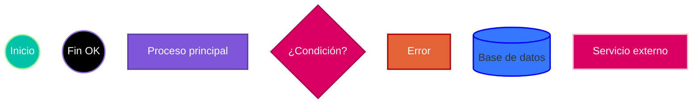
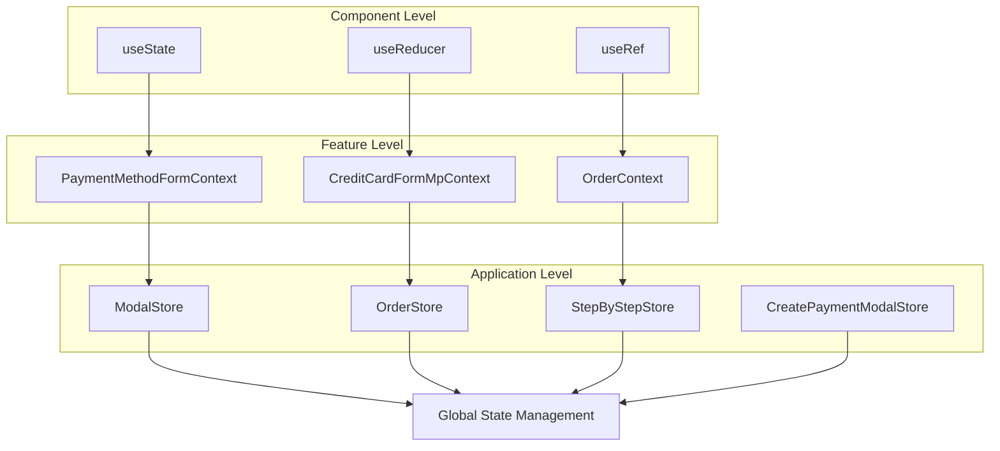
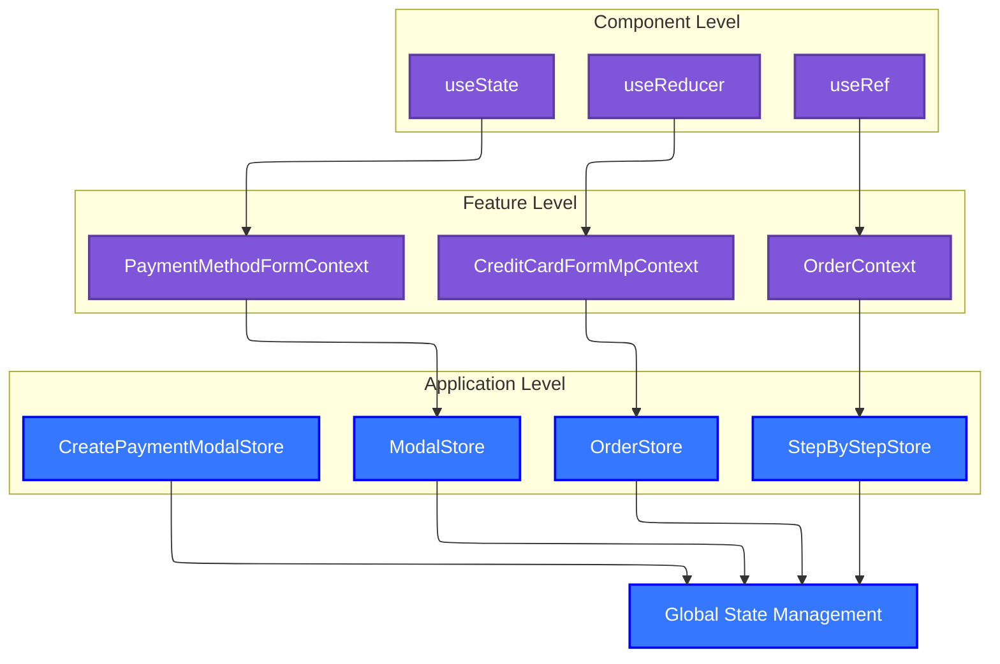

# Copilot Customization: Generación de Documentación Detallada

## Objetivo

Automatizar la generación de documentación en la carpeta `docs` del proyecto, creando archivos `.md` para cada caso de uso o funcionalidad existente, siguiendo estas reglas:

### Para cada archivo de documentación generado:

- Incluye una breve explicación del caso de uso o funcionalidad.
- Agrega diagramas en Mermaid de los siguientes tipos según corresponda: flujo, secuencia, arquitectura, datos y componentes.
- Añade explicaciones complementarias para cada diagrama.
- No inventes información ni agregues funcionalidades que no existan en el proyecto.

### Para el archivo `README.md` principal:

- Incluye un resumen de la documentación generada.
- Agrega enlaces directos a cada archivo `.md` en la carpeta `docs` para facilitar la navegación.
- Si no existe, crea una sección clara y organizada con los comandos necesarios para:
  - Ejecutar el proyecto.
  - Correr los tests.
  - Realizar el build.
- Mejora la estructura y experiencia de usuario del README si detectas oportunidades.

### 🧩 Encabezado introductorio del README.md

Al inicio del archivo `README.md`, incluye un encabezado con las siguientes características:

- Un título principal (`#`) que identifique claramente el nombre del proyecto o aplicación.
- Una serie de badges informativos que resuman aspectos clave del proyecto, como:
  - Plataforma o tecnología principal (por ejemplo, VTEX IO, Node.js, React, etc.).
  - Versión actual del proyecto.
  - Estado del build, cobertura de tests u otras métricas relevantes.
- Una descripción breve y clara (1 a 3 párrafos) que explique:
  - El propósito general de la aplicación.
  - Su funcionalidad principal o casos de uso.
  - Público objetivo o contexto de uso (si aplica).

**Reglas adicionales:**

- Los badges deben utilizar servicios como [shields.io](https://shields.io/) y enlazar a archivos relevantes del repositorio (por ejemplo, `package.json`, etc.).
- La descripción debe estar redactada en lenguaje técnico accesible, evitando jergas innecesarias.
- Este encabezado debe colocarse antes de cualquier otra sección del `README.md`.

---

## Formato y sintaxis de los archivos Markdown

- Los nombres de los archivos generados para la documentación deben estar siempre en kebab case (ejemplo: `mi-funcionalidad.md`).
- Usa títulos de nivel 2 (`##`) para cada funcionalidad o caso de uso documentado.
- Integra una tabla de contenido (`[TOC]` o manual) si el archivo supera las 500 líneas.
- Prioriza el uso de tablas para listar parámetros, configuraciones o resultados.
- Los enlaces internos deben ser relativos, no absolutos.
- Usa emojis solo para mejorar la experiencia visual, no para sustituir información técnica.

---

## Referencias cruzadas y enlaces internos

- Al documentar funcionalidades que interactúan entre sí, agrega enlaces relativos a los archivos correspondientes dentro de `docs`.
- Asegúrate de que todos los enlaces estén actualizados y funcionen antes de aprobar cambios.

---

## Versionado y actualización de documentación

- Cada cambio significativo en el código que afecte la funcionalidad debe reflejarse en los archivos de documentación correspondientes.
- Actualiza o elimina documentación obsoleta y procura mantener los ejemplos alineados con el código fuente actual.

---

## Formato y ubicación de imágenes y recursos externos

- Aloja imágenes, capturas o recursos externos en la carpeta `/docs/assets`.
- Referencia las imágenes en los archivos `.md` usando rutas relativas, por ejemplo: ``
- Si usas imágenes generadas automáticamente, verifica su calidad y relevancia.

---

## Estilo de escritura

- Redacta en lenguaje claro, conciso y técnico, evitando ambigüedades y jergas innecesarias.
- Si el proyecto es internacional, prioriza la documentación en inglés, salvo que el equipo indique lo contrario.

---

## Manejo de documentación obsoleta

- Identifica y elimina archivos que ya no representen funcionalidades vigentes.
- Si la funcionalidad está en desuso pero aún es relevante para migraciones, agrega una advertencia clara al inicio del archivo.

---

## Validación y actualización de README.md

Al finalizar la documentación, **valida el archivo `README.md` principal del proyecto**:

- Verifica que todos los enlaces a archivos `.md` dentro de la carpeta `/docs` estén actualizados y apunten a los archivos que realmente existen.
- Remueve del `README.md` los enlaces a archivos `.md` que ya no existan en `/docs`.
- Agrega nuevos enlaces en el `README.md` para toda documentación relevante generada en `/docs` que aún no esté referenciada.

---

## Validación antes de merge

- Antes de aprobar un PR, revisa que los diagramas Mermaid se rendericen correctamente y que los enlaces funcionen.
- Verifica que las clases y colores aplicados sigan la convención definida y que las relaciones de los diagramas no se pierdan en conversiones.
- Valida y actualiza los enlaces del `README.md` principal para reflejar la documentación actualizada.

---

## Convención de colores y estilos para diagramas Mermaid

Para mantener la coherencia visual y semántica en los diagramas Mermaid, utiliza las siguientes clases y colores:

- **statementClass**: Morado (`#7f56d9`), texto blanco. Para procesos, acciones o pasos principales.
- **conditionalClass**: Fucsia (`#da0063`), texto blanco. Para nodos de decisión o condicionales.
- **inicioClass**: Verde agua (`#00c2a8`), texto blanco. Para nodos de inicio.
- **finClass**: Negro, texto blanco. Para nodos de fin o estados terminales.
- **rejectClass**: Naranja (`#e36236`), texto blanco. Para rechazos, errores o validaciones fallidas.
- **dbClass**: Azul (`#3578ff`), texto blanco. Para bases de datos o almacenamiento persistente.
- **amazonClass**: Fucsia (`#da0063`), texto blanco. Para servicios externos, buses de eventos o integraciones.
- **backendClass**: Morado (`#7f56d9`), texto blanco. Para procesos internos de backend.

Ejemplo de inicialización y uso en Mermaid (solo para diagramas compatibles):

**Usa siempre estas clases y colores para mantener la consistencia visual y semántica en todos los diagramas Mermaid generados en la documentación, pero solo donde sea compatible (ver sección de compatibilidad).**

---

## Compatibilidad de estilos Mermaid y conversión de diagramas

**Importante:**  
Las clases personalizadas Mermaid (`classDef`) y la inicialización global (`%%{init: ...}%%`) solo se pueden aplicar a diagramas de tipo `flowchart` o `classDiagram`.

No los uses en diagramas de tipo `sequenceDiagram`, `gantt`, `erDiagram`, `pie`, `stateDiagram`, etc., ya que pueden causar errores de renderizado o impedir el preview correcto.

### Conversión de diagramas tipo `graph` para aplicar estilos

Si encuentras un diagrama Mermaid de tipo `graph` (por ejemplo, para arquitectura o dependencias entre componentes) y se requiere aplicar la convención de colores y estilos definida, **convierte el diagrama de `graph` a `flowchart`**. Así podrás asignar clases y colores a los nodos según corresponda.

#### **Al convertir diagramas tipo `graph` a `flowchart`, sigue estas reglas:**

1. **Mantén la estructura lógica y jerarquía del diagrama original.**
2. **Agrupa los nodos en subgraph según corresponda (componentes, features, aplicación, etc.).**
3. **No cambies los nombres de los nodos; respeta los identificadores para que las conexiones permanezcan correctas.**
4. **Incluye todas las conexiones (flechas) del diagrama original y ponlas fuera de los subgraph para conservar las dependencias.**
5. **Aplica las clases de colores a los nodos según el tipo definido en la convención.**
6. **Revisa que el resultado visual y las relaciones sean equivalentes al diagrama original.**

#### Ejemplo de conversión correcta:

Original (no compatible con estilos):

Convertido (compatible con estilos y clases, manteniendo conexiones):

- En otros tipos de diagramas (secuencia, Gantt, ERD, componentes, arquitectura, datos, etc.), utiliza únicamente la sintaxis estándar de Mermaid sin clases personalizadas ni inicialización, a menos que los conviertas a `flowchart` o `classDiagram` siguiendo las reglas anteriores.

**Siempre verifica el tipo de diagrama antes de aplicar estilos personalizados. Convierte los diagramas a tipos compatibles si quieres aplicar la convención de colores y estilos.**

**Al convertir, asegúrate de conservar todas las relaciones (flechas) originales y agrupar correctamente los nodos en subgraph, para no perder la semántica ni las dependencias del diagrama.**

---

## Proceso sugerido para Copilot

1. Lee la estructura y los archivos existentes en la carpeta `docs` y el template del README.
2. Usa solo la información real del proyecto y su código fuente.
3. Resume y organiza la documentación de manera clara y navegable.
4. Integra los diagramas Mermaid en los archivos `.md` según el tipo de funcionalidad, aplicando colores y clases solo donde corresponda.
5. Si un diagrama no soporta estilos pero requiere la convención de colores, conviértelo a `flowchart` o `classDiagram` y aplica las clases, siguiendo las reglas de conversión y asegurando que todas las conexiones originales se mantengan.
6. Actualiza el README con enlaces y resúmenes, sin duplicar información ni inventar funcionalidades.
7. Revisa que el Encabezado introductorio del README.md contenga el título, badges y descripción del proyecto de acuerdo a las reglas definidas.

---
