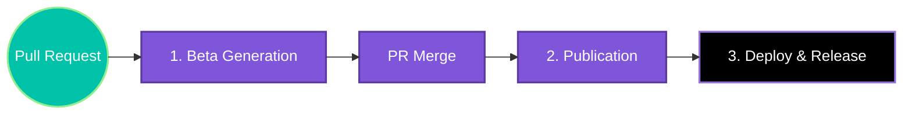
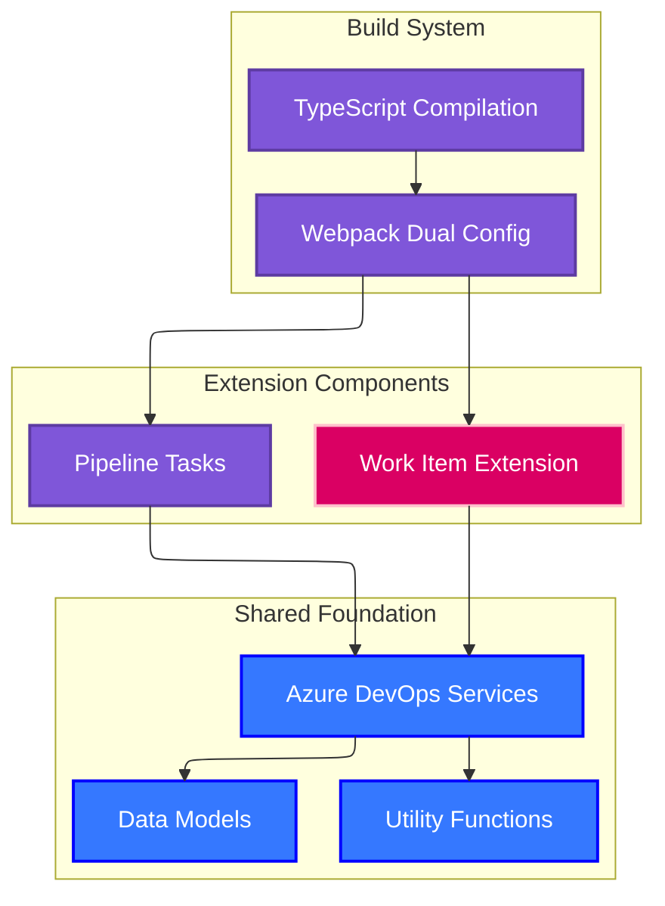

# VTEX IO Azure DevOps Extension

[](https://marketplace.visualstudio.com/items?itemName=MaikRestrepo.vtex-io-ci-cd)
[](https://vtex.com)
[](https://www.typescriptlang.org/)
[](https://nodejs.org/)
[](https://github.com/Maik3345/azure-devops-vtex-extension)
[](./package.json)

A comprehensive **dual-purpose Azure DevOps extension** that provides both work item management capabilities and a complete collection of Azure DevOps pipeline tasks specifically designed for VTEX IO development workflows.

## 🎯 Purpose and Functionality

This extension serves two primary functions:

1. **Work Item Extension**: Enhances Azure DevOps work items with automated branch information generation and comment management
2. **VTEX CI/CD Pipeline Tasks**: Provides 11 specialized Azure DevOps pipeline tasks for complete VTEX IO development automation

The extension is designed for VTEX IO development teams who need streamlined CI/CD processes, automated release management, and enhanced work item tracking capabilities within their Azure DevOps environment.

## 🎯 Target Audience

- **VTEX IO Developers**: Teams building applications on the VTEX IO platform
- **DevOps Engineers**: Professionals implementing CI/CD automation for VTEX projects  
- **Project Managers**: Teams using Azure DevOps for VTEX project management and tracking

## ✨ Key Features

### Work Item Management
- **Automated Branch Name Generation**: Creates standardized branch names from work item titles and sprint information
- **Smart Comment Integration**: Adds formatted branch information directly to work items
- **Simple User Interface**: Uses intuitive browser dialogs for seamless user experience

### VTEX CI/CD Automation
- **Complete Authentication Flow**: Secure VTEX login and session management
- **Deployment Automation**: Automated app deployment to VTEX workspaces
- **Publishing Pipeline**: Streamlined app publishing to VTEX registry
- **Release Management**: Automated version bumping, changelog generation, and Git release creation
- **Pull Request Integration**: Automated PR creation, merging, and completion workflows
- **Dependency Management**: Automated project setup and dependency configuration

### Advanced Pipeline Features
- **Error Handling**: Comprehensive error reporting with pull request thread integration
- **Parallel Processing**: Optimized task execution for faster pipeline performance
- **Security Integration**: Secure credential management using Azure DevOps variable groups
- **Monitoring Support**: Built-in logging and metrics collection for pipeline observability

## 📚 Documentation

### Core Components
- [**Work Item Extension**](./docs/work-item-extension.md) - Branch information management for Azure DevOps work items
- [**VTEX Pipeline Tasks**](./docs/vtex-pipeline-tasks.md) - Complete VTEX IO CI/CD automation tasks
- [**Git Integration Tasks**](./docs/git-integration-tasks.md) - Advanced Git operations and pull request management
- [**Shared Services & Utilities**](./docs/shared-services-utilities.md) - Common services and utility functions

### Development & Deployment
- [**Build System & Configuration**](./docs/build-system-configuration.md) - Webpack configuration and build processes
- [**Deployment & Release Process**](./docs/deployment-release-process.md) - Complete deployment and release workflows

## 🚀 Quick Start

### Prerequisites
- **Azure DevOps Organization**: Active Azure DevOps instance
- **Node.js 16+**: For Azure DevOps agent compatibility
- **VTEX Account**: Valid VTEX account with API credentials
- **PNPM**: Package manager for development

### Installation from Marketplace

1. **Install the Extension**
   ```bash
   # Visit Azure DevOps Marketplace
   https://marketplace.visualstudio.com/items?itemName=MaikRestrepo.vtex-io-ci-cd
   ```

2. **Configure Permissions**
   - Add **Contribute to pull requests** permission to **Project Collection Build Service Accounts**
   - Navigate to: Project → Repository → Security

   

3. **Set Up Variable Groups**
   ```yaml
   # Create variable group with VTEX credentials
   VTEX_API_KEY: "your-vtex-api-key"
   VTEX_API_TOKEN: "your-vtex-api-token"  
   VTEX_EMAIL: "your-vtex-email"
   VTEX_ACCOUNT: "your-vtex-account-name"
   ```

### Basic Pipeline Configuration

```yaml
# azure-pipelines.yml
trigger:
  branches:
    include:
    - main

variables:
- group: vtex-credentials

stages:
- stage: Setup
  jobs:
  - job: Dependencies
    steps:
    - task: SetupDependencies@1
      displayName: 'Setup Project Dependencies'

- stage: Authentication  
  jobs:
  - job: VTEXLogin
    steps:
    - task: VtexLogin@1
      displayName: 'Login to VTEX'
      inputs:
        apiKey: $(VTEX_API_KEY)
        apiToken: $(VTEX_API_TOKEN)
        email: $(VTEX_EMAIL)
        account: $(VTEX_ACCOUNT)

- stage: Deploy
  jobs:
  - job: VTEXDeploy
    steps:
    - task: VtexDeploy@1
      displayName: 'Deploy to VTEX Workspace'
```

## 🔧 Development Commands

### Building the Extension
```bash
# Install dependencies
pnpm install

# Build all tasks
pnpm run build:tasks

# Build extension 
pnpm run build:extension

# Build everything
pnpm run build

# Watch mode for development
pnpm run watch
```

### Testing
```bash
# Run unit tests
pnpm run test

# Run tests with coverage
pnpm run test:coverage

# Run integration tests
pnpm run test:integration
```

### Linting and Quality
```bash
# Run ESLint
pnpm run lint

# Fix linting issues
pnpm run lint:fix

# Type checking
pnpm run type-check
```

## 📋 Available Pipeline Tasks

### VTEX Tasks
| Task                               | Description                    | Documentation                                               |
| ---------------------------------- | ------------------------------ | ----------------------------------------------------------- |
| **VtexLogin**                      | Authenticate with VTEX APIs    | [README](./tasks/vtex/login/README.md)                      |
| **VtexDeploy**                     | Deploy app to VTEX workspace   | [README](./tasks/vtex/deploy/README.md)                     |
| **VtexPublish**                    | Publish app to VTEX registry   | [README](./tasks/vtex/publish/README.md)                    |
| **VtexChangeOriginToSourceBranch** | Git branch management for VTEX | [README](./tasks/vtex/changeOriginToSourceBranch/README.md) |

### Git Integration Tasks  
| Task                              | Description                        | Documentation                                               |
| --------------------------------- | ---------------------------------- | ----------------------------------------------------------- |
| **GitPullRequestMergeIntoBranch** | Merge PR into target branch        | [README](./tasks/git/pullRequest/mergeIntoBranch/README.md) |
| **GitPullRequestRelease**         | Create release PR with changelog   | [README](./tasks/git/pullRequest/release/README.md)         |
| **GitPullRequestLabels**          | Auto-manage PR labels using projex | [README](./tasks/git/pullRequest/labels/README.md)          |
| **GitRelease**                    | Handle complete release automation | [README](./tasks/git/release/README.md)                     |

### Project Management Tasks
| Task                         | Description                    | Documentation                                         |
| ---------------------------- | ------------------------------ | ----------------------------------------------------- |
| **ProjectSetupDependencies** | Configure project dependencies | [README](./tasks/project/setupDependencies/README.md) |

## 🔄 Pipeline Templates

This extension provides YAML pipeline templates to simplify your CI/CD workflows for VTEX IO projects. These templates are organized in a logical workflow order:

### Available Templates

| Template                                                             | Purpose                 | Usage                                     |
| -------------------------------------------------------------------- | ----------------------- | ----------------------------------------- |
| **[1.beta.yml](./docs/azure-devops/1.beta.yml)**                     | Beta version generation | Creates beta versions for PR testing      |
| **[2.publish.yml](./docs/azure-devops/2.publish.yml)**               | Production publication  | Publishes apps to VTEX registry           |
| **[3.deploy-release.yml](./docs/azure-devops/3.deploy-release.yml)** | Deployment & release    | Final deployment and Git release creation |

### Workflow Sequence



### Example Implementation

```yaml
# azure-pipelines.yml
trigger: none

pr:
  branches:
    include:
      - main

extends:
  template: docs/azure-devops/1.beta.yml
  parameters:
    account: 'your-vtex-account'
    email: '$(VTEX_EMAIL)'
    apiKey: '$(VTEX_API_KEY)'
    apiToken: '$(VTEX_API_TOKEN)'
    environment: 'development'
```

## 🏗️ Architecture Overview

The extension follows a modular architecture with clear separation of concerns:



## 🔧 Development & Contribution

### Development Setup

1. **Clone and Setup**
   ```bash
   git clone https://github.com/Maik3345/azure-devops-vtex-extension
   cd azure-devops-vtex-extension
   pnpm install
   ```

2. **Start Development**
   ```bash
   # Watch mode for tasks
   pnpm run watch:tasks
   
   # Watch mode for extension
   pnpm run watch:extension
   ```

3. **Testing Changes**
   ```bash
   # Build and test
   pnpm run build
   pnpm run test
   
   # Package for testing
   pnpm run package
   ```

### Version Management

- **Extension Version**: Controlled in `vss-extension.json`
- **Task Versions**: Each task has independent versioning in `task.json`
- **Automated Updates**: Use `updateVersion.js` script for synchronized updates

### Contribution Guidelines

1. **Feature Development**: Create feature branches from `main`
2. **Testing**: Ensure all tests pass and add new tests for features
3. **Documentation**: Update relevant documentation in `/docs`
4. **Pull Requests**: Use the automated PR template system
5. **Code Quality**: Follow TypeScript strict mode and ESLint rules

## 📊 Extension Metrics

| Metric                    | Value                                            |
| ------------------------- | ------------------------------------------------ |
| **Total Tasks**           | 11 specialized pipeline tasks                    |
| **Supported Platforms**   | Azure DevOps Server 2020+, Azure DevOps Services |
| **Node.js Compatibility** | 16.x, 18.x, 20.x                                 |
| **TypeScript Version**    | 4.9+                                             |
| **Build Target**          | Dual (Node.js + Browser)                         |
| **Package Size**          | Optimized for fast installation                  |

## 🤝 Support & Community

### Getting Help
- **Documentation**: Comprehensive guides in `/docs` folder
- **GitHub Issues**: [Report bugs and request features](https://github.com/Maik3345/azure-devops-vtex-extension/issues)
- **VTEX Community**: [VTEX IO Developer Portal](https://developers.vtex.com/)

### Contributing
- **Code Contributions**: Follow the development setup and contribution guidelines
- **Documentation**: Help improve documentation and examples
- **Testing**: Report issues and help test new features

## 📄 License

This project is licensed under the MIT License. See the [LICENSE](LICENSE) file for details.

---

**Built with ❤️ for the VTEX IO community**
