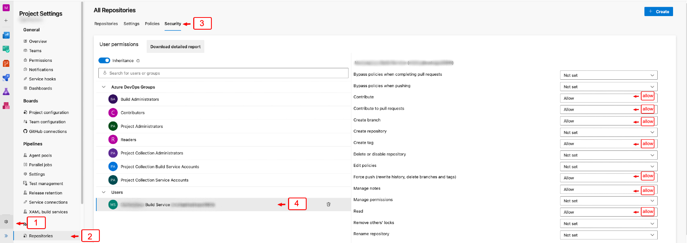

# VTEX IO CI/CD

This project is a VTEX IO app that provides a set of tasks to automate the CI/CD process in the VTEX IO platform.

## Features

- Push messages in the thread of the pull request.
- Create pull request in the specified repository with the changes of the current pull request
- Create the logic for complete the pull request and make the release process with the cli `projex`
- Create the logic to control the exceptions and errors in the task and generate the error message in the pull request thread.
- Implement the step to setup the core settings of the tasks, install `projex`, `vtex` and `yarn install` in the pipeline.
- Implement the logic for make the login in the VTEX account with the `apiKey` and `apiToken` in the pipeline, this parameters are required to execute the tasks and is passed in the input of the task.

# Usage

When extension is added to your organization then you can find it from the extensions list or you can add it simply to your yaml pipeline with the following task command:

`VtexBuildBeta` and `VtexBuildRelease` are the tasks that you can use in your pipeline.

```yaml
- task: VtexBuildBeta@0
  inputs:
    account: $(VTEX_ACCOUNT_NAME_PROD)
    email: $(VTEX_EMAIL_PROD)
    apiKey: $(VTEX_API_KEY_PROD)
    apiToken: $(VTEX_API_TOKEN_PROD)
    devBranch: 'develop'
  displayName: 'Beta publish'
```

Or

```yaml
- task: VtexBuildRelease@0
  inputs:
    account: $(VTEX_ACCOUNT_NAME_PROD)
    email: $(VTEX_EMAIL_PROD)
    apiKey: $(VTEX_API_KEY_PROD)
    apiToken: $(VTEX_API_TOKEN_PROD)
  displayName: 'Publish and deploy'
```

# Installation

You can install the extension to your Azure DevOps organization from Marketplace:
[VTEX IO CI/CD Utilities](https://marketplace.visualstudio.com/items?itemName=MaikRestrepo.vtex-io-ci-cd)

You may need to add **Contribute to pull requests** permission to your **Project Collection Build Service Accounts** from project -> repository -> **Security**.



# Task flow

## VtexBuildBeta

1. **Setup**: Install: `projex`, `vtex` and `yarn install` in the pipeline and make the login in the VTEX account with the `apiKey` and `apiToken`, this parameters are required to execute the tasks and is passed in the input of the task.
2. **Get release type**: Get the release type from the pull request title, if the title contains the word `[minor|patch|major|changed]` then the task will execute the release process, if not, the task will execute the beta process, example: `[minor] Merge feature/test into master`.
3. **Get release version**: Get the release version, this process use the cli `projex` to get the release version to apply using the `releaseType`
4. **Set email and user name in git**: Set the email and user name in the git configuration, this is required to make the commit and push in the repository, this process use the email and name from the user that create the pull request.
5. **Change origin to the current sourceRefName**: Change the origin to the current sourceRefName, this is required to make the commit and push in the repository.
6. **Show start message**: Show the start message in the pull request thread.
7. **Make the publish beta app**: Make the publish beta app using the cli `projex`, this process use the release `prerelease` type to change the manifest.json file but not make the changes in the repository, before this process execute `vtex publish` to publish that changes in the VTEX account.
8. **Create release**: Create the release in the repository with the changes of the current pull request, this process use the cli `projex` to create the release in the repository.
9. **Create pull request in develop automatically**: Create the pull request in the specified repository with the changes of the current pull request, this process use the azure api to make the pull request in the repository and complete automatically.
10. **Show end message**: Show the end message in the pull request thread.

## VtexBuildRelease

1. **Setup**: Install: `projex`, `vtex` and `yarn install` in the pipeline and make the login in the VTEX account with the `apiKey` and `apiToken`, this parameters are required to execute the tasks and is passed in the input of the task.
2. **Get release type**: Get the release type from the pull request title, if the title contains the word `[minor|patch|major|changed]` then the task will execute the release process, if not, the task will execute the beta process, example: `[minor] Merge feature/test into master`.
3. **Get release version**: Get the release version, this process use the cli `projex` to get the release version to apply using the `releaseType`
4. **Set email and user name in git**: Set the email and user name in the git configuration, this is required to make the commit and push in the repository, this process use the email and name from the user that create the pull request.
5. **Change origin to the current sourceRefName**: Change the origin to the current sourceRefName, this is required to make the commit and push in the repository.
6. **Show start message**: Show the start message in the pull request thread.
7. **Make the publish beta app**: Make the publish beta app using the cli `projex`, this process use the release `prerelease` type to change the manifest.json file but not make the changes in the repository, before this process execute `vtex publish` to publish that changes in the VTEX account.
8. **Complete the pull request**: Complete the pull request using the azure api.
9. **Change the origin to the targetRefName**: Change the origin to the targetRefName, this is required to make the commit and push in the repository.
10. **Create release**: Create the release in the repository with the changes of the current pull request, this process use the cli `projex` to create the release in the repository.
11. **Show end message**: Show the end message in the pull request thread.

# Development and contribution

To contribute to this project, you need to clone the repository and install the dependencies:

```bash
npm install
```

To install all package dependencies in the tasks run the following command:

```bash

npm run initdev
```

To start the development server, you need to run the following command:

```bash
npm run dev
```

When make any change in the tasks, you need to update the version of the `task.json` and the `vss-extension.json`

To build the extension, you need to run the following command:

```bash
npm run build
```
