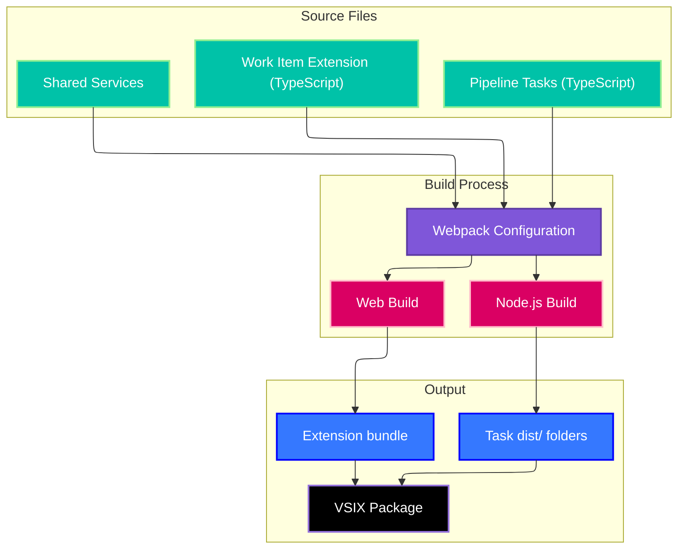
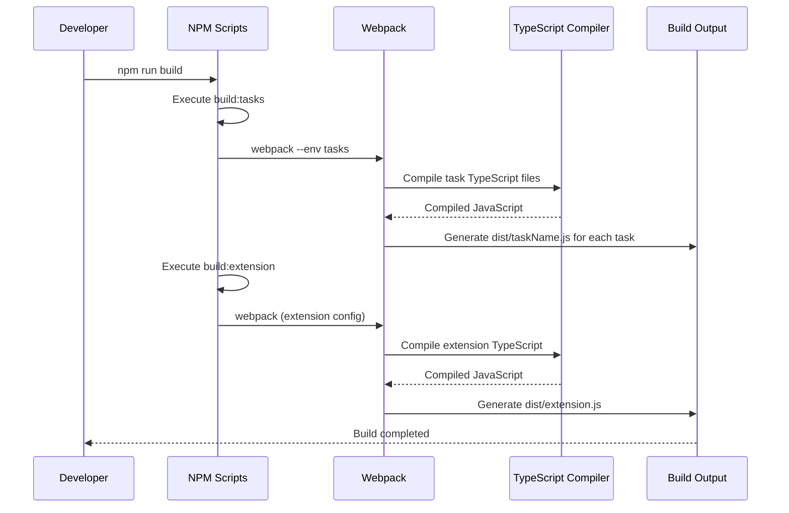

# Build System and Configuration

## Overview

The build system for the VTEX Azure DevOps Extension uses a sophisticated dual-configuration approach with Webpack to handle both Azure DevOps pipeline tasks (Node.js environment) and the work item extension (browser environment). This document explains the build architecture, configuration, and development workflows.

## Architecture Overview



## Webpack Configuration

### Dual Configuration Strategy

The project uses a single webpack configuration file that generates different builds based on the entry point:

```javascript
// webpack.config.js
const path = require('path');
const glob = require('glob');

// Get all task TypeScript files
const taskEntries = glob.sync('./tasks/**/!(*shared*)/*.ts').reduce((entries, file) => {
    const name = path.basename(file, '.ts');
    const dir = path.dirname(file).split('/').pop();
    entries[`${dir}/${name}`] = file;
    return entries;
}, {});

module.exports = (env, argv) => {
    const isTasksBuild = env && env.tasks;
    
    if (isTasksBuild) {
        return getTasksConfig(taskEntries);
    } else {
        return getExtensionConfig();
    }
};
```

### Tasks Build Configuration

```javascript
function getTasksConfig(entries) {
    return {
        target: 'node',
        mode: 'production',
        entry: entries,
        output: {
            path: path.resolve(__dirname),
            filename: (pathData) => {
                const [category, taskName] = pathData.chunk.name.split('/');
                return `tasks/${category}/${taskName}/dist/${taskName}.js`;
            },
            libraryTarget: 'commonjs2'
        },
        resolve: {
            extensions: ['.ts', '.js'],
            modules: ['node_modules']
        },
        module: {
            rules: [
                {
                    test: /\.ts$/,
                    use: {
                        loader: 'ts-loader',
                        options: {
                            configFile: 'tsconfig.json'
                        }
                    },
                    exclude: /node_modules/
                }
            ]
        },
        externals: {
            // Azure DevOps task lib modules
            'azure-pipelines-task-lib/task': 'commonjs azure-pipelines-task-lib/task',
            'azure-devops-node-api': 'commonjs azure-devops-node-api'
        },
        optimization: {
            minimize: false // Keep readable for debugging
        }
    };
}
```

### Extension Build Configuration

```javascript
function getExtensionConfig() {
    return {
        target: 'web',
        mode: 'production',
        entry: './src/WorkItemCommentService.ts',
        output: {
            path: path.resolve(__dirname, 'dist'),
            filename: 'extension.js',
            library: {
                type: 'umd',
                name: 'WorkItemExtension'
            }
        },
        resolve: {
            extensions: ['.ts', '.js']
        },
        module: {
            rules: [
                {
                    test: /\.ts$/,
                    use: 'ts-loader',
                    exclude: /node_modules/
                }
            ]
        },
        externals: {
            // Azure DevOps Extension SDK
            'azure-devops-extension-sdk': 'SDK',
            'azure-devops-extension-api': 'API'
        }
    };
}
```

## TypeScript Configuration

### Root TypeScript Configuration

```json
{
  "compilerOptions": {
    "target": "ES2020",
    "module": "commonjs",
    "lib": ["ES2020", "DOM"],
    "outDir": "./dist",
    "rootDir": "./",
    "strict": true,
    "esModuleInterop": true,
    "skipLibCheck": true,
    "forceConsistentCasingInFileNames": true,
    "moduleResolution": "node",
    "resolveJsonModule": true,
    "declaration": true,
    "declarationMap": true,
    "sourceMap": true
  },
  "include": [
    "src/**/*",
    "tasks/**/*",
    "typings/**/*"
  ],
  "exclude": [
    "node_modules",
    "**/dist/**",
    "**/*.test.ts"
  ]
}
```

### Task-Specific TypeScript Configuration

Each task has its own `tsconfig.json` for specific compilation needs:

```json
{
  "extends": "../../../tsconfig.json",
  "compilerOptions": {
    "outDir": "./dist",
    "rootDir": "./",
    "target": "ES2020",
    "module": "commonjs"
  },
  "include": [
    "./*.ts",
    "../shared/**/*.ts"
  ],
  "exclude": [
    "./dist/**",
    "node_modules"
  ]
}
```

## Build Scripts

### Package.json Scripts

```json
{
  "scripts": {
    "build": "npm run build:tasks && npm run build:extension",
    "build:tasks": "webpack --env tasks",
    "build:extension": "webpack",
    "watch": "npm run watch:tasks",
    "watch:tasks": "webpack --env tasks --watch",
    "watch:extension": "webpack --watch",
    "clean": "rimraf tasks/**/dist dist",
    "lint": "eslint src tasks --ext .ts",
    "test": "jest",
    "package": "npm run build && tfx extension create"
  }
}
```

### Build Process Flow



## Development Workflow

### Local Development Setup

1. **Install Dependencies**
   ```bash
   pnpm install
   ```

2. **Start Watch Mode**
   ```bash
   pnpm run watch:tasks  # For task development
   pnpm run watch:extension  # For extension development
   ```

3. **Build for Testing**
   ```bash
   pnpm run build
   ```

4. **Package Extension**
   ```bash
   pnpm run package
   ```

### Hot Reload Configuration

For development efficiency, the build system supports watch mode:

```javascript
// webpack.config.js - Watch configuration
module.exports = {
    watch: process.env.NODE_ENV === 'development',
    watchOptions: {
        ignored: /node_modules/,
        aggregateTimeout: 300,
        poll: 1000
    }
};
```

## Task Compilation Details

### Individual Task Build Process

Each task is compiled independently to its own `dist/` directory:

```
tasks/
├── vtex/
│   ├── login/
│   │   ├── login.ts          # Source
│   │   ├── task.json         # Task definition
│   │   ├── tsconfig.json     # TypeScript config
│   │   └── dist/
│   │       └── login.js      # Compiled output
│   └── deploy/
│       ├── deploy.ts
│       ├── task.json
│       ├── tsconfig.json
│       └── dist/
│           └── deploy.js
```

### Shared Module Bundling

Shared modules are bundled into each task to avoid runtime dependencies:

```javascript
// Webpack configuration for shared modules
resolve: {
    alias: {
        '@shared': path.resolve(__dirname, 'tasks/shared')
    }
}
```

### Task Entry Point Generation

Webpack automatically discovers task entry points:

```javascript
const taskEntries = glob.sync('./tasks/**/!(*shared*)/*.ts').reduce((entries, file) => {
    // Exclude shared directory and test files
    if (!file.includes('/shared/') && !file.includes('.test.')) {
        const taskPath = path.relative('./tasks', file);
        const name = taskPath.replace(/\.ts$/, '').replace(/\//g, '_');
        entries[name] = file;
    }
    return entries;
}, {});
```

## Extension Bundle Configuration

### Browser Compatibility

The extension bundle targets modern browsers with Azure DevOps compatibility:

```javascript
module.exports = {
    target: ['web', 'es2020'],
    module: {
        rules: [
            {
                test: /\.ts$/,
                use: {
                    loader: 'ts-loader',
                    options: {
                        compilerOptions: {
                            target: 'ES2020',
                            module: 'ESNext'
                        }
                    }
                }
            }
        ]
    }
};
```

### External Dependencies

Azure DevOps extension APIs are treated as externals:

```javascript
externals: {
    'azure-devops-extension-sdk': 'SDK',
    'azure-devops-extension-api': 'API',
    'vss-web-extension-sdk': 'VSS'
}
```

## Package Management

### PNPM Configuration

The project uses PNPM for efficient dependency management:

```json
{
  "packageManager": "pnpm@8.0.0",
  "engines": {
    "node": ">=16.0.0",
    "pnpm": ">=8.0.0"
  }
}
```

### Dependencies Structure

```json
{
  "dependencies": {
    "azure-devops-node-api": "^12.0.0",
    "azure-pipelines-task-lib": "^4.0.0"
  },
  "devDependencies": {
    "webpack": "^5.75.0",
    "ts-loader": "^9.4.0",
    "typescript": "^4.9.0",
    "tfx-cli": "^0.12.0"
  }
}
```

## Environment Configuration

### Development Environment

```bash
# Development build with source maps
NODE_ENV=development pnpm run build

# Production build optimized
NODE_ENV=production pnpm run build
```

### CI/CD Environment Variables

| Variable | Description | Example |
|----------|-------------|---------|
| `NODE_ENV` | Build environment | `production` |
| `BUILD_NUMBER` | CI build number | `20231201.1` |
| `EXTENSION_VERSION` | Extension version override | `1.0.0` |

## Optimization Strategies

### Code Splitting

Tasks are built separately to minimize bundle size:

```javascript
optimization: {
    splitChunks: false, // Each task is independent
    minimize: process.env.NODE_ENV === 'production'
}
```

### Tree Shaking

Unused code elimination for extension bundle:

```javascript
module.exports = {
    mode: 'production',
    optimization: {
        usedExports: true,
        sideEffects: false
    }
};
```

### Asset Optimization

```javascript
module: {
    rules: [
        {
            test: /\.(png|jpg|gif)$/,
            type: 'asset/resource',
            generator: {
                filename: 'images/[name][ext]'
            }
        }
    ]
}
```

## Testing Integration

### Test Configuration

```javascript
// Jest configuration for testing
module.exports = {
    preset: 'ts-jest',
    testEnvironment: 'node',
    testMatch: ['**/*.test.ts'],
    collectCoverageFrom: [
        'tasks/**/*.ts',
        'src/**/*.ts',
        '!**/node_modules/**',
        '!**/dist/**'
    ]
};
```

### Test Build Scripts

```json
{
  "scripts": {
    "test": "jest",
    "test:watch": "jest --watch",
    "test:coverage": "jest --coverage",
    "test:ci": "jest --ci --coverage --watchAll=false"
  }
}
```

## Deployment and Packaging

### VSIX Package Generation

```bash
# Build and package extension
pnpm run build
tfx extension create --manifest-globs vss-extension.json
```

### Package Structure

```
extension.vsix
├── vss-extension.json    # Extension manifest
├── tasks/                # All compiled tasks
│   ├── vtex/
│   ├── git/
│   └── project/
├── dist/                 # Extension bundle
└── images/               # Icons and screenshots
```

## Troubleshooting Build Issues

### Common Problems

1. **TypeScript Compilation Errors**
   ```bash
   # Clear TypeScript cache
   pnpm run clean
   pnpm run build
   ```

2. **Webpack Bundle Issues**
   ```bash
   # Verbose webpack output
   webpack --env tasks --verbose
   ```

3. **Task Discovery Problems**
   ```bash
   # Check glob pattern matches
   node -e "console.log(require('glob').sync('./tasks/**/!(*shared*)/*.ts'))"
   ```

### Debug Configuration

```javascript
module.exports = {
    mode: 'development',
    devtool: 'source-map',
    stats: 'verbose'
};
```

## Performance Monitoring

### Build Performance

```javascript
// webpack.config.js
const SpeedMeasurePlugin = require('speed-measure-webpack-plugin');

module.exports = {
    plugins: [
        new SpeedMeasurePlugin()
    ]
};
```

### Bundle Analysis

```bash
# Analyze bundle size
webpack-bundle-analyzer dist/extension.js
```

## Future Improvements

### Planned Enhancements

- **Module Federation**: Share common modules between tasks
- **Progressive Builds**: Only rebuild changed tasks
- **Advanced Caching**: Persistent build caching
- **Hot Module Replacement**: Real-time development updates

### Architecture Evolution

- **Micro-frontend Architecture**: Separate extension components
- **ESM Support**: Modern module format adoption
- **WebAssembly Integration**: Performance-critical operations
- **CDN Asset Distribution**: Optimized asset delivery
