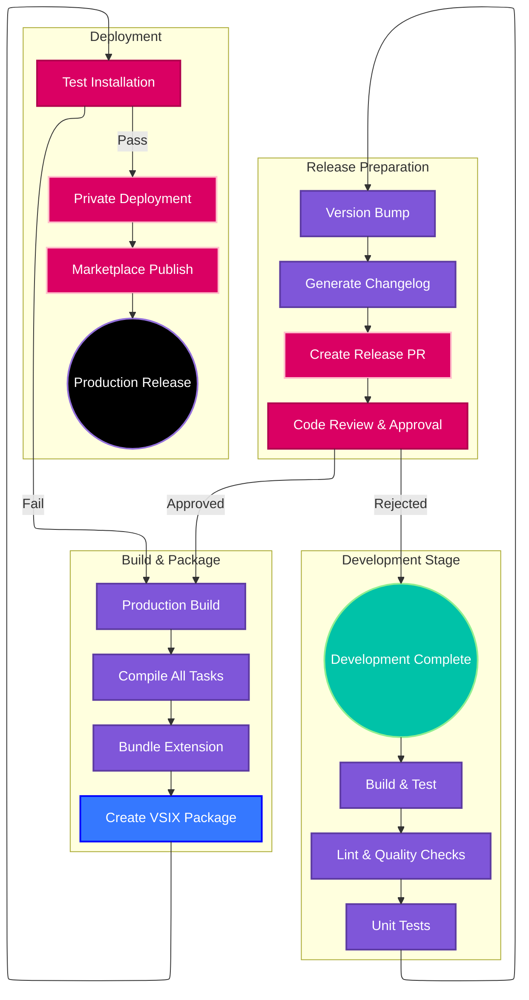
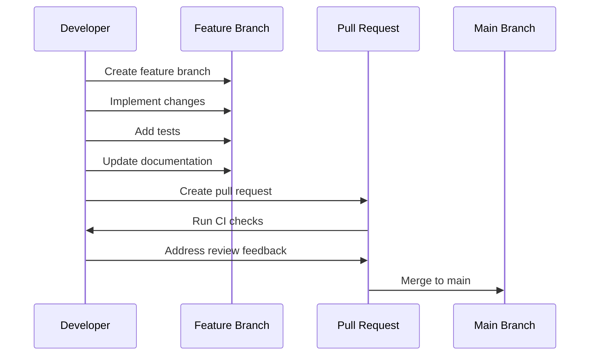
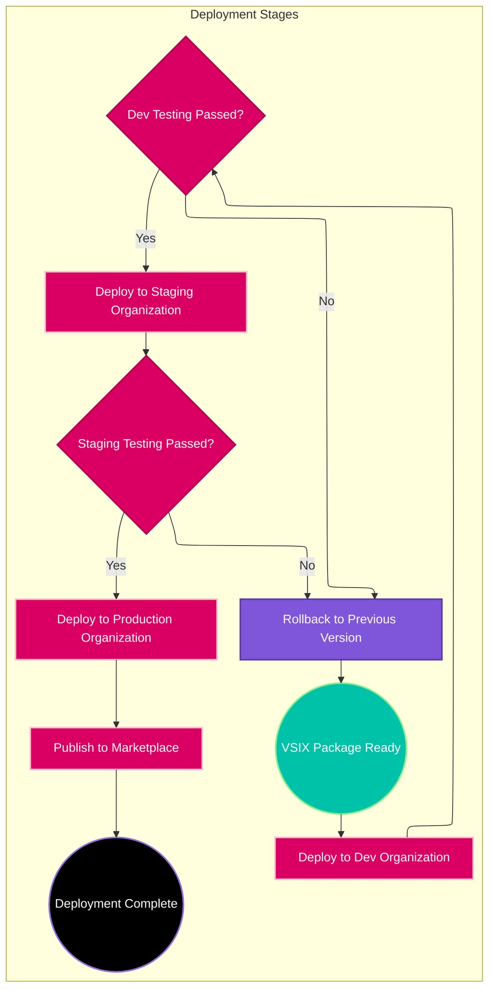

# Deployment and Release Process

## Overview

The deployment and release process for the VTEX Azure DevOps Extension involves multiple stages, from development through testing to production deployment. This document outlines the complete release workflow, versioning strategy, and deployment procedures.

## Release Architecture



## Version Management Strategy

### Semantic Versioning

The extension follows semantic versioning (semver) principles:

- **Major (X.0.0)**: Breaking changes to task interfaces or extension functionality
- **Minor (X.Y.0)**: New features, new tasks, or significant enhancements
- **Patch (X.Y.Z)**: Bug fixes, security patches, and minor improvements

### Version Synchronization

All components maintain synchronized versions:

```json
{
  "extension": "1.0.0",
  "tasks": {
    "VtexLogin": "1.0.0",
    "VtexDeploy": "1.0.0",
    "VtexPublish": "1.0.0",
    "MergeIntoBranch": "1.0.0",
    "ReleasePullRequest": "1.0.0",
    "Release": "1.0.0",
    "SetupDependencies": "1.0.0"
  }
}
```

### Version Update Automation

```javascript
// updateVersion.js
const fs = require('fs');
const glob = require('glob');

function updateAllVersions(newVersion) {
    // Update extension version
    const extensionManifest = JSON.parse(fs.readFileSync('vss-extension.json'));
    extensionManifest.version = newVersion;
    fs.writeFileSync('vss-extension.json', JSON.stringify(extensionManifest, null, 2));
    
    // Update all task versions
    const taskFiles = glob.sync('tasks/**/task.json');
    taskFiles.forEach(taskFile => {
        const task = JSON.parse(fs.readFileSync(taskFile));
        const [major, minor, patch] = newVersion.split('.');
        task.version = {
            Major: parseInt(major),
            Minor: parseInt(minor),
            Patch: parseInt(patch)
        };
        fs.writeFileSync(taskFile, JSON.stringify(task, null, 2));
    });
    
    console.log(`Updated all versions to ${newVersion}`);
}

module.exports = { updateAllVersions };
```

## CI/CD Pipeline Configuration

### Azure DevOps Pipeline

```yaml
# azure-pipelines.yml
trigger:
  branches:
    include:
    - main
    - release/*
  paths:
    exclude:
    - docs/*
    - README.md

variables:
  nodeVersion: '16.x'
  extensionName: 'vtex-io-devops'

stages:
- stage: Build
  displayName: 'Build and Test'
  jobs:
  - job: BuildAndTest
    displayName: 'Build and Test Extension'
    pool:
      vmImage: 'ubuntu-latest'
    
    steps:
    - task: NodeTool@0
      displayName: 'Install Node.js'
      inputs:
        versionSpec: $(nodeVersion)
    
    - script: |
        npm install -g pnpm
        pnpm install
      displayName: 'Install Dependencies'
    
    - script: pnpm run lint
      displayName: 'Run Linting'
    
    - script: pnpm run test:ci
      displayName: 'Run Tests'
    
    - script: pnpm run build
      displayName: 'Build Extension'
    
    - task: PublishTestResults@2
      displayName: 'Publish Test Results'
      inputs:
        testResultsFormat: 'JUnit'
        testResultsFiles: 'coverage/junit.xml'
    
    - task: PublishCodeCoverageResults@1
      displayName: 'Publish Code Coverage'
      inputs:
        codeCoverageTool: 'Cobertura'
        summaryFileLocation: 'coverage/cobertura-coverage.xml'

- stage: Package
  displayName: 'Package Extension'
  dependsOn: Build
  condition: and(succeeded(), eq(variables['Build.SourceBranch'], 'refs/heads/main'))
  jobs:
  - job: PackageExtension
    displayName: 'Create VSIX Package'
    pool:
      vmImage: 'ubuntu-latest'
    
    steps:
    - task: NodeTool@0
      inputs:
        versionSpec: $(nodeVersion)
    
    - script: |
        npm install -g pnpm tfx-cli
        pnpm install
      displayName: 'Install Dependencies'
    
    - script: pnpm run build
      displayName: 'Build Extension'
    
    - script: |
        tfx extension create --manifest-globs vss-extension.json
      displayName: 'Create VSIX Package'
    
    - task: PublishBuildArtifacts@1
      displayName: 'Publish VSIX Artifact'
      inputs:
        pathToPublish: '$(extensionName)-$(Build.BuildNumber).vsix'
        artifactName: 'extension-package'

- stage: Deploy
  displayName: 'Deploy Extension'
  dependsOn: Package
  condition: and(succeeded(), eq(variables['Build.SourceBranch'], 'refs/heads/main'))
  jobs:
  - deployment: DeployToMarketplace
    displayName: 'Deploy to Marketplace'
    environment: 'production'
    strategy:
      runOnce:
        deploy:
          steps:
          - task: DownloadBuildArtifacts@0
            inputs:
              artifactName: 'extension-package'
          
          - script: |
              tfx extension publish --vsix $(Agent.BuildDirectory)/extension-package/$(extensionName)-$(Build.BuildNumber).vsix --token $(MarketplaceToken)
            displayName: 'Publish to Marketplace'
```

## Release Workflow

### 1. Feature Development



### 2. Release Preparation

```bash
#!/bin/bash
# scripts/prepare-release.sh

set -e

# Get current version
CURRENT_VERSION=$(node -p "require('./vss-extension.json').version")
echo "Current version: $CURRENT_VERSION"

# Prompt for new version
read -p "Enter new version (e.g., 1.1.0): " NEW_VERSION

# Validate semantic version format
if [[ ! $NEW_VERSION =~ ^[0-9]+\.[0-9]+\.[0-9]+$ ]]; then
    echo "Error: Invalid version format. Use semantic versioning (e.g., 1.0.0)"
    exit 1
fi

# Update versions
node updateVersion.js $NEW_VERSION

# Generate changelog
npm run changelog:generate

# Create release branch
git checkout -b "release/$NEW_VERSION"
git add .
git commit -m "chore: prepare release $NEW_VERSION"
git push origin "release/$NEW_VERSION"

# Create pull request
gh pr create \
    --title "Release $NEW_VERSION" \
    --body "Automated release preparation for version $NEW_VERSION" \
    --base main \
    --head "release/$NEW_VERSION"

echo "Release preparation complete. Please review and merge the PR."
```

### 3. Automated Changelog Generation

```javascript
// scripts/generate-changelog.js
const { execSync } = require('child_process');
const fs = require('fs');

function generateChangelog() {
    const lastTag = execSync('git describe --tags --abbrev=0').toString().trim();
    const commits = execSync(`git log ${lastTag}..HEAD --pretty=format:"%h %s"`).toString().trim();
    
    const changes = {
        features: [],
        fixes: [],
        breaking: [],
        other: []
    };
    
    commits.split('\n').forEach(commit => {
        const [hash, ...messageParts] = commit.split(' ');
        const message = messageParts.join(' ');
        
        if (message.includes('feat:') || message.includes('feature:')) {
            changes.features.push(`- ${message} (${hash})`);
        } else if (message.includes('fix:') || message.includes('bug:')) {
            changes.fixes.push(`- ${message} (${hash})`);
        } else if (message.includes('BREAKING:')) {
            changes.breaking.push(`- ${message} (${hash})`);
        } else {
            changes.other.push(`- ${message} (${hash})`);
        }
    });
    
    const version = require('../package.json').version;
    const date = new Date().toISOString().split('T')[0];
    
    let changelog = `## [${version}] - ${date}\n\n`;
    
    if (changes.breaking.length > 0) {
        changelog += '### 🚨 Breaking Changes\n' + changes.breaking.join('\n') + '\n\n';
    }
    
    if (changes.features.length > 0) {
        changelog += '### ✨ Features\n' + changes.features.join('\n') + '\n\n';
    }
    
    if (changes.fixes.length > 0) {
        changelog += '### 🐛 Bug Fixes\n' + changes.fixes.join('\n') + '\n\n';
    }
    
    if (changes.other.length > 0) {
        changelog += '### 🔧 Other Changes\n' + changes.other.join('\n') + '\n\n';
    }
    
    // Prepend to existing changelog
    const existingChangelog = fs.existsSync('CHANGELOG.md') 
        ? fs.readFileSync('CHANGELOG.md', 'utf8') 
        : '';
    
    const newChangelog = changelog + existingChangelog;
    fs.writeFileSync('CHANGELOG.md', newChangelog);
    
    console.log('Changelog generated successfully');
}

generateChangelog();
```

## Deployment Strategies

### Private Organization Deployment

For internal/private deployment to specific Azure DevOps organizations:

```bash
# Deploy to specific organization
tfx extension publish \
    --vsix extension.vsix \
    --share-with organization1 organization2 \
    --token $MARKETPLACE_TOKEN
```

### Public Marketplace Deployment

For public marketplace deployment:

```bash
# Publish to public marketplace
tfx extension publish \
    --vsix extension.vsix \
    --token $MARKETPLACE_TOKEN \
    --public
```

### Staged Deployment Process



## Quality Assurance

### Pre-deployment Testing

```bash
#!/bin/bash
# scripts/test-deployment.sh

echo "Starting deployment testing..."

# Install extension locally
tfx extension install --vsix extension.vsix --service-url https://dev.azure.com/test-org

# Run integration tests
npm run test:integration

# Test specific scenarios
echo "Testing VTEX login task..."
# Add specific test scenarios

# Test work item extension
echo "Testing work item extension..."
# Add UI testing scenarios

echo "Deployment testing complete"
```

### Rollback Procedures

```bash
#!/bin/bash
# scripts/rollback.sh

PREVIOUS_VERSION=$1

if [ -z "$PREVIOUS_VERSION" ]; then
    echo "Usage: ./rollback.sh <previous-version>"
    exit 1
fi

echo "Rolling back to version $PREVIOUS_VERSION..."

# Unpublish current version
tfx extension unpublish --publisher --extension-id vtex-io-devops

# Re-publish previous version
tfx extension publish --vsix "backups/extension-$PREVIOUS_VERSION.vsix"

echo "Rollback to $PREVIOUS_VERSION complete"
```

## Security Considerations

### Secure Credential Management

```yaml
# Azure DevOps Variable Groups
variables:
- group: marketplace-secrets
  variables:
  - name: MarketplaceToken
    value: $(MARKETPLACE_PAT)
    isSecret: true
  - name: TestOrgToken
    value: $(TEST_ORG_PAT)
    isSecret: true
```

### Code Signing

```bash
# Sign extension package
codesign --sign "Developer ID" --timestamp extension.vsix
```

### Vulnerability Scanning

```yaml
- task: SecurityCodeAnalysis@3
  displayName: 'Run Security Scan'
  inputs:
    scanType: 'full'
    includeNodeModules: false
```

## Monitoring and Analytics

### Deployment Metrics

```javascript
// Track deployment metrics
const deploymentMetrics = {
    version: process.env.EXTENSION_VERSION,
    timestamp: new Date().toISOString(),
    buildId: process.env.BUILD_BUILDID,
    environment: process.env.DEPLOYMENT_ENVIRONMENT,
    success: true
};

// Send to monitoring system
fetch('https://monitoring.example.com/metrics', {
    method: 'POST',
    body: JSON.stringify(deploymentMetrics)
});
```

### Usage Analytics

```typescript
// Extension usage tracking
interface UsageEvent {
    event: string;
    version: string;
    timestamp: Date;
    organization: string;
    userId?: string;
}

function trackUsage(event: string): void {
    const usage: UsageEvent = {
        event,
        version: getExtensionVersion(),
        timestamp: new Date(),
        organization: getCurrentOrganization()
    };
    
    // Send to analytics service
    sendAnalytics(usage);
}
```

## Documentation Updates

### Release Notes Template

```markdown
# Release Notes - Version X.Y.Z

## 🚀 What's New

### New Features
- Feature 1 description
- Feature 2 description

### Improvements
- Improvement 1 description
- Improvement 2 description

### Bug Fixes
- Fix 1 description
- Fix 2 description

## 📋 Requirements

- Azure DevOps Server 2020+ or Azure DevOps Services
- Node.js 16+ for pipeline agents

## 🚀 Installation

1. Install from [Azure DevOps Marketplace](marketplace-link)
2. Configure your pipeline tasks
3. Start using VTEX automation!

## 📚 Documentation

- [Getting Started Guide](docs-link)
- [Task Reference](task-docs-link)
- [Migration Guide](migration-link)

## 🐛 Known Issues

- Issue 1 description and workaround
- Issue 2 description and workaround

## 💬 Support

For support and feedback:
- GitHub Issues: [repository-link]
- Documentation: [docs-link]
```

## Future Enhancements

### Planned Improvements

- **Automated Testing**: Enhanced integration test coverage
- **Blue-Green Deployment**: Zero-downtime deployment strategy
- **Feature Flags**: Gradual feature rollout capability
- **Enhanced Monitoring**: Real-time usage and error tracking

### Architecture Evolution

- **Microservice Deployment**: Independent task deployment
- **CDN Distribution**: Global asset distribution
- **Auto-scaling**: Dynamic resource allocation
- **Multi-cloud Support**: Cloud-agnostic deployment strategy
