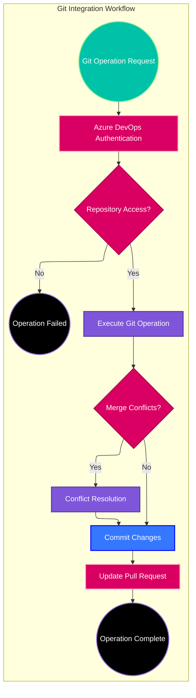
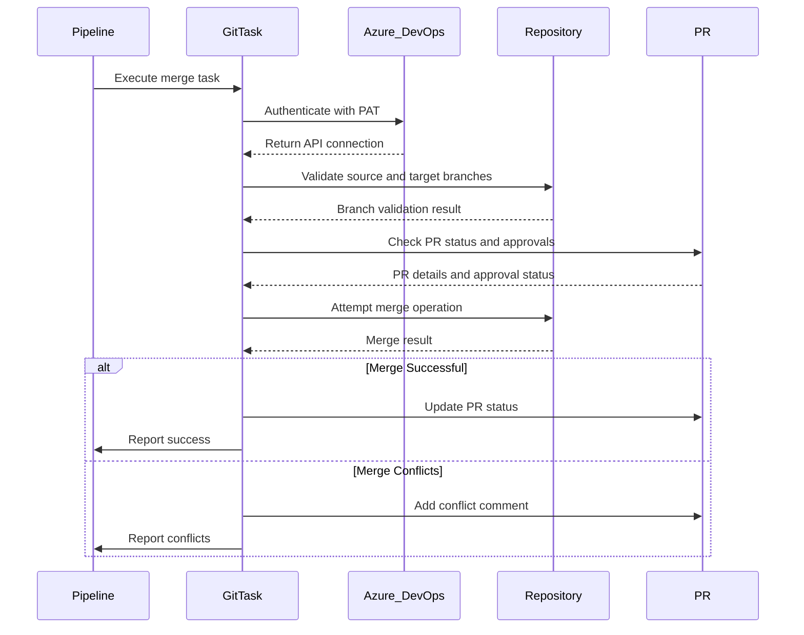
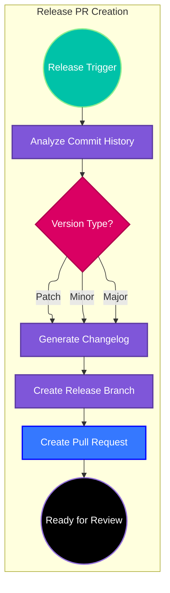

# Git Integration Tasks

## Overview

The Git Integration Tasks provide automated Git operations for Azure DevOps pipelines, focusing on pull request management, branch operations, and release automation. These tasks integrate with Azure DevOps Git repositories to streamline development workflows.

## Task Categories

### Pull Request Management

#### Merge Into Branch Task (`git/pullRequest/mergeIntoBranch`)

Automatically merges pull requests into target branches with validation and conflict resolution.

**Features:**
- Automated merge validation
- Conflict detection and reporting
- Branch protection rule compliance
- Merge commit message customization

#### Release Pull Request Task (`git/pullRequest/release`)

Creates release pull requests with automated changelog generation and version management.

**Features:**
- Automated changelog generation
- Version bump detection
- Release notes compilation
- Tag creation and management

#### Pull Request Labels Task (`git/pullRequest/labels`)

Automatically manages pull request labels using projex suggestions and Azure DevOps API integration.

**Features:**
- Intelligent label suggestion using projex CLI
- Duplicate label prevention
- Outdated label removal
- Custom label support
- Dry run mode for testing

### Release Management

#### Release Task (`git/release`)

Handles complete release automation including tagging, changelog updates, and deployment preparation.

**Features:**
- Semantic version management
- Release branch creation
- Automated documentation updates
- Integration with deployment pipelines

## Architecture Overview



## Pull Request Workflow

### Merge Into Branch Process

The merge into branch task follows this sequence:



### Release Pull Request Creation



## Shared Services Integration

### Azure Connection Service

All Git tasks use the shared Azure connection service:

```typescript
import { azureConnection } from '../shared/services';

const connection = await azureConnection();
const { gitApi, repositoryId, pullRequest } = connection;
```

### Connection Interface

```typescript
interface AzureConnectionType {
    gitApi: GitApi;
    repositoryId: string;
    pullRequest?: GitPullRequest;
    project: string;
    organizationUrl: string;
}
```

## Pull Request Management

### Creating Pull Requests

```typescript
import { createPullRequest } from '../shared/services';

const prDetails = {
    title: 'Release v1.2.0',
    description: 'Automated release pull request',
    sourceRefName: 'refs/heads/release/1.2.0',
    targetRefName: 'refs/heads/main',
    reviewers: ['team@company.com']
};

const pullRequest = await createPullRequest(connection, prDetails);
```

### Completing Pull Requests

```typescript
import { completePullRequest } from '../shared/services';

await completePullRequest(connection, {
    pullRequestId: pullRequest.pullRequestId,
    mergeStrategy: 'squash',
    deleteSourceBranch: true
});
```

### Adding PR Comments

```typescript
import { pullRequestThread } from '../shared/services';

await pullRequestThread(connection, 'Automated merge completed successfully', {
    status: 'succeeded',
    commentType: 'system'
});
```

## Git Utilities

### Command Execution

```typescript
import { runCommand } from '../shared/utils';

// Execute git commands safely
await runCommand('git fetch origin');
await runCommand('git checkout main');
await runCommand('git merge --no-ff feature-branch');
```

### Branch Operations

```typescript
import { git } from '../shared/utils';

// Create new branch
await git.createBranch('feature/new-feature');

// Switch branches
await git.checkout('main');

// Merge branches
await git.merge('feature/new-feature', { noFf: true });
```

## Release Management

### Version Detection

```typescript
import { getReleaseVersion } from '../shared/utils';

const versionInfo = await getReleaseVersion();
console.log(`Next version: ${versionInfo.nextVersion}`);
console.log(`Release type: ${versionInfo.releaseType}`);
```

### Changelog Generation

```typescript
import { generateChangelog } from '../shared/utils';

const changelog = await generateChangelog({
    fromTag: 'v1.1.0',
    toTag: 'HEAD',
    format: 'markdown'
});
```

## Error Handling Patterns

### Git Operation Errors

```typescript
try {
    await git.merge(sourceBranch, targetBranch);
} catch (error) {
    if (error.message.includes('conflict')) {
        // Handle merge conflicts
        await pullRequestThread(
            connection, 
            `Merge conflicts detected in ${sourceBranch} -> ${targetBranch}`
        );
        setResult(TaskResult.Failed, 'Merge conflicts require manual resolution');
    } else {
        // Handle other git errors
        setResult(TaskResult.Failed, `Git operation failed: ${error.message}`);
    }
}
```

### API Connection Errors

```typescript
try {
    const connection = await azureConnection();
} catch (error) {
    if (error.message.includes('authentication')) {
        setResult(TaskResult.Failed, 'Azure DevOps authentication failed. Check PAT token.');
    } else {
        setResult(TaskResult.Failed, `Connection error: ${error.message}`);
    }
}
```

## Configuration Examples

### Merge Into Branch Task

```yaml
- task: MergeIntoBranch@1
  displayName: 'Merge Feature into Main'
  inputs:
    sourceBranch: '$(System.PullRequest.SourceBranch)'
    targetBranch: 'refs/heads/main'
    mergeStrategy: 'squash'
    deleteSourceBranch: true
```

### Release Pull Request Task

```yaml
- task: ReleasePullRequest@1
  displayName: 'Create Release PR'
  inputs:
    releaseType: 'minor'
    targetBranch: 'refs/heads/main'
    includeBuildId: true
    generateChangelog: true
```

### Release Task

```yaml
- task: Release@1
  displayName: 'Create Release'
  inputs:
    tagName: 'v$(Build.BuildNumber)'
    releaseName: 'Release $(Build.BuildNumber)'
    generateReleaseNotes: true
    publishArtifacts: true
```

## Integration with VTEX Workflows

### VTEX Release Pipeline

```yaml
stages:
- stage: CreateReleasePR
  jobs:
  - job: ReleasePR
    steps:
    - task: ReleasePullRequest@1
      inputs:
        releaseType: 'minor'
        
- stage: VTEXDeploy
  dependsOn: CreateReleasePR
  condition: succeeded()
  jobs:
  - job: Deploy
    steps:
    - task: VtexLogin@1
      inputs:
        apiKey: $(VTEX_API_KEY)
        apiToken: $(VTEX_API_TOKEN)
        
    - task: VtexPublish@1
      displayName: 'Publish to VTEX Registry'
```

## Advanced Features

### Automated Conflict Resolution

```typescript
async function resolveConflicts(conflictFiles: string[]): Promise<void> {
    for (const file of conflictFiles) {
        const content = await fs.readFile(file, 'utf8');
        
        // Simple conflict resolution strategies
        if (file.endsWith('.json')) {
            await resolveJsonConflicts(file, content);
        } else if (file.endsWith('.md')) {
            await resolveMarkdownConflicts(file, content);
        }
    }
}
```

### Smart Branch Protection

```typescript
async function validateBranchProtection(targetBranch: string): Promise<boolean> {
    const protection = await gitApi.getBranchProtection(repositoryId, targetBranch);
    
    if (protection.requiresStatusChecks) {
        const checks = await gitApi.getStatusChecks(repositoryId, targetBranch);
        return checks.every(check => check.state === 'succeeded');
    }
    
    return true;
}
```

## Monitoring and Logging

### Operation Metrics

```typescript
interface GitOperationMetrics {
    operationType: 'merge' | 'release' | 'branch';
    executionTime: number;
    success: boolean;
    conflictsResolved: number;
    filesChanged: number;
}

function logMetrics(metrics: GitOperationMetrics): void {
    console.log(`##vso[task.setvariable variable=git.${metrics.operationType}.duration]${metrics.executionTime}`);
    console.log(`##vso[task.setvariable variable=git.${metrics.operationType}.success]${metrics.success}`);
}
```

### Audit Trail

```typescript
async function createAuditLog(operation: string, details: any): Promise<void> {
    const auditEntry = {
        timestamp: new Date().toISOString(),
        operation,
        user: process.env.BUILD_REQUESTEDFOREMAIL,
        buildId: process.env.BUILD_BUILDID,
        details
    };
    
    await pullRequestThread(connection, 
        `Audit: ${operation} executed by ${auditEntry.user}`,
        { auditData: auditEntry }
    );
}
```

## Troubleshooting Guide

### Common Issues

1. **Authentication Failures**
   - Verify Personal Access Token (PAT) permissions
   - Check repository access permissions
   - Ensure token hasn't expired

2. **Merge Conflicts**
   - Review conflicting files manually
   - Use conflict resolution strategies
   - Consider rebasing instead of merging

3. **Branch Protection Violations**
   - Verify required status checks pass
   - Ensure required reviewers approved
   - Check branch protection rules

### Debug Configuration

```yaml
- task: GitTask@1
  inputs:
    verboseLogging: true
    debugMode: true
  env:
    SYSTEM_DEBUG: true
```

## Future Enhancements

### Planned Features

- Advanced conflict resolution algorithms
- Integration with external code review tools
- Automated dependency update handling
- Enhanced release note generation

### Architecture Improvements

- Event-driven git operations
- Webhook integration for real-time updates
- Machine learning for intelligent conflict resolution
- Enhanced security scanning integration
