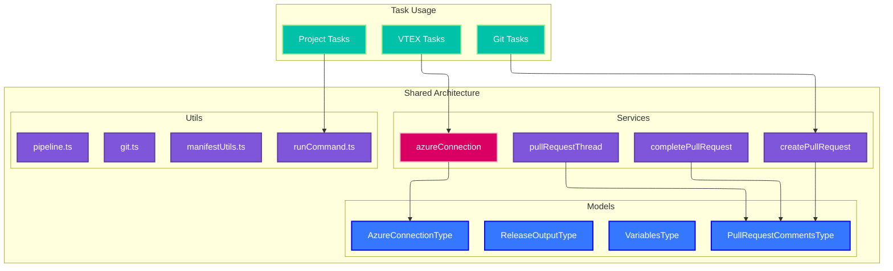

# Shared Services and Utilities

## Overview

The shared services and utilities provide a centralized foundation for all Azure DevOps tasks in the extension. These components handle common operations like Azure DevOps API connections, pull request management, git operations, and utility functions used across multiple tasks.

## Architecture



## Core Models

### AzureConnectionType

Defines the interface for Azure DevOps API connections:

```typescript
export interface AzureConnectionType {
    gitApi: GitApi;
    repositoryId: string;
    pullRequest?: GitPullRequest;
    project: string;
    organizationUrl: string;
}
```

**Usage:**
- Provides authenticated Git API access
- Contains repository context information
- Includes current pull request data when available

### PullRequestCommentsType

Structure for pull request comment management:

```typescript
export interface PullRequestCommentsType {
    id: number;
    content: string;
    author: string;
    timestamp: Date;
    commentType: 'system' | 'user' | 'automated';
    status?: 'active' | 'resolved' | 'pending';
}
```

**Features:**
- Standardized comment structure
- Support for different comment types
- Status tracking for comment resolution

### ReleaseOutputType

Defines release automation data structure:

```typescript
export interface ReleaseOutputType {
    version: string;
    releaseType: 'major' | 'minor' | 'patch' | 'prerelease';
    changelog: string;
    tagName: string;
    releaseBranch: string;
    artifacts: string[];
}
```

**Usage:**
- Version management across tasks
- Changelog generation and storage
- Release artifact tracking

## Core Services

### Azure Connection Service

Manages authenticated connections to Azure DevOps APIs:

```typescript
export const azureConnection = async (): Promise<AzureConnectionType> => {
    const organizationUrl = getVariable('System.TeamFoundationCollectionUri');
    const project = getVariable('System.TeamProject');
    const repositoryId = getVariable('Build.Repository.ID');
    
    const authHandler = getPersonalAccessTokenHandler(accessToken);
    const connection = new WebApi(organizationUrl, authHandler);
    const gitApi = await connection.getGitApi();
    
    return {
        gitApi,
        repositoryId,
        project,
        organizationUrl
    };
};
```

**Features:**
- Automatic authentication handling
- Repository context detection
- Error handling for connection failures

### Pull Request Management

#### Create Pull Request Service

```typescript
export const createPullRequest = async (
    azureConnection: AzureConnectionType,
    prDetails: {
        title: string;
        description: string;
        sourceRefName: string;
        targetRefName: string;
        reviewers?: string[];
    }
): Promise<GitPullRequest> => {
    const { gitApi, repositoryId } = azureConnection;
    
    const pullRequestToCreate: GitPullRequest = {
        title: prDetails.title,
        description: prDetails.description,
        sourceRefName: prDetails.sourceRefName,
        targetRefName: prDetails.targetRefName,
        reviewers: prDetails.reviewers?.map(reviewer => ({ id: reviewer }))
    };
    
    return await gitApi.createPullRequest(pullRequestToCreate, repositoryId);
};
```

#### Complete Pull Request Service

```typescript
export const completePullRequest = async (
    azureConnection: AzureConnectionType,
    options: {
        pullRequestId: number;
        mergeStrategy?: 'merge' | 'squash' | 'rebase';
        deleteSourceBranch?: boolean;
    }
): Promise<GitPullRequest> => {
    const { gitApi, repositoryId } = azureConnection;
    
    const completionOptions = {
        mergeCommitMessage: `Merged PR ${options.pullRequestId}`,
        deleteSourceBranch: options.deleteSourceBranch || false,
        mergeStrategy: options.mergeStrategy || 'merge'
    };
    
    return await gitApi.updatePullRequest(
        { status: PullRequestStatus.Completed, ...completionOptions },
        repositoryId,
        options.pullRequestId
    );
};
```

#### Pull Request Thread Service

```typescript
export const pullRequestThread = async (
    azureConnection: AzureConnectionType,
    content: string,
    options?: {
        status?: 'active' | 'fixed' | 'wontFix';
        commentType?: CommentType;
        threadContext?: any;
    }
): Promise<GitPullRequestCommentThread> => {
    const { gitApi, repositoryId, pullRequest } = azureConnection;
    
    if (!pullRequest) {
        throw new Error('Pull request context required for thread operations');
    }
    
    const thread: GitPullRequestCommentThread = {
        comments: [{
            content,
            commentType: options?.commentType || CommentType.Text
        }],
        status: options?.status || 'active',
        threadContext: options?.threadContext
    };
    
    return await gitApi.createThread(thread, repositoryId, pullRequest.pullRequestId);
};
```

## Utility Functions

### Git Operations

```typescript
export const git = {
    async getCurrentBranch(): Promise<string> {
        const result = await runCommand('git rev-parse --abbrev-ref HEAD');
        return result.trim();
    },
    
    async createBranch(branchName: string, startPoint?: string): Promise<void> {
        const command = startPoint 
            ? `git checkout -b ${branchName} ${startPoint}`
            : `git checkout -b ${branchName}`;
        await runCommand(command);
    },
    
    async checkout(branchName: string): Promise<void> {
        await runCommand(`git checkout ${branchName}`);
    },
    
    async merge(sourceBranch: string, options?: { noFf?: boolean }): Promise<void> {
        const flags = options?.noFf ? '--no-ff' : '';
        await runCommand(`git merge ${flags} ${sourceBranch}`);
    },
    
    async getChangedFiles(fromRef?: string, toRef?: string): Promise<string[]> {
        const range = fromRef && toRef ? `${fromRef}..${toRef}` : 'HEAD';
        const result = await runCommand(`git diff --name-only ${range}`);
        return result.split('\n').filter(line => line.trim());
    }
};
```

### Command Execution

```typescript
export const runCommand = async (
    command: string,
    options?: {
        cwd?: string;
        timeout?: number;
        env?: Record<string, string>;
    }
): Promise<string> => {
    return new Promise((resolve, reject) => {
        const process = spawn('sh', ['-c', command], {
            cwd: options?.cwd || process.cwd(),
            env: { ...process.env, ...options?.env },
            stdio: 'pipe'
        });
        
        let stdout = '';
        let stderr = '';
        
        process.stdout?.on('data', (data) => {
            stdout += data.toString();
        });
        
        process.stderr?.on('data', (data) => {
            stderr += data.toString();
        });
        
        const timeoutId = options?.timeout 
            ? setTimeout(() => {
                process.kill();
                reject(new Error(`Command timeout: ${command}`));
            }, options.timeout)
            : null;
        
        process.on('close', (code) => {
            if (timeoutId) clearTimeout(timeoutId);
            
            if (code === 0) {
                resolve(stdout);
            } else {
                reject(new Error(`Command failed: ${command}\nStderr: ${stderr}`));
            }
        });
    });
};
```

### VTEX Manifest Utilities

```typescript
export const manifestUtils = {
    async readManifest(path: string = './manifest.json'): Promise<any> {
        const content = await fs.readFile(path, 'utf8');
        return JSON.parse(content);
    },
    
    async writeManifest(manifest: any, path: string = './manifest.json'): Promise<void> {
        const content = JSON.stringify(manifest, null, 2);
        await fs.writeFile(path, content, 'utf8');
    },
    
    async updateVersion(newVersion: string, path?: string): Promise<void> {
        const manifest = await this.readManifest(path);
        manifest.version = newVersion;
        await this.writeManifest(manifest, path);
    },
    
    async getDependencies(path?: string): Promise<Record<string, string>> {
        const manifest = await this.readManifest(path);
        return manifest.dependencies || {};
    }
};
```

### Pipeline Utilities

```typescript
export const pipeline = {
    getVariable(name: string): string | undefined {
        return getVariable(name);
    },
    
    setVariable(name: string, value: string): void {
        setVariable(name, value);
    },
    
    setOutput(name: string, value: string): void {
        console.log(`##vso[task.setvariable variable=${name};isOutput=true]${value}`);
    },
    
    addAttachment(type: string, name: string, path: string): void {
        console.log(`##vso[task.addattachment type=${type};name=${name}]${path}`);
    },
    
    logWarning(message: string): void {
        console.log(`##vso[task.logissue type=warning]${message}`);
    },
    
    logError(message: string): void {
        console.log(`##vso[task.logissue type=error]${message}`);
    }
};
```

## Constants and Enums

### Release Types

```typescript
export enum ReleaseType {
    minor = 'minor',
    patch = 'patch',
    major = 'major',
    changed = 'changed',
    prerelease = 'prerelease',
}
```

### Changelog Sections

```typescript
export enum ChangelogSection {
    added = 'Added',
    changed = 'Changed',
    fixed = 'Fixed',
    major = 'Major',
}
```

### Command Constants

```typescript
export const CHANGELOG_FILE_NAME = 'CHANGELOG.md';
export const PUBLISH_DEFAULT_COMMAND = 'projex vtex run "vtex publish --yes --force"';
export const DEPLOY_DEFAULT_COMMAND = 'projex vtex run "vtex deploy --force"';
```

## Error Handling Patterns

### Service Error Handling

```typescript
export class ServiceError extends Error {
    constructor(
        message: string,
        public readonly service: string,
        public readonly operation: string,
        public readonly originalError?: Error
    ) {
        super(message);
        this.name = 'ServiceError';
    }
}

export const handleServiceError = (error: any, service: string, operation: string): never => {
    const message = error.message || 'Unknown service error';
    throw new ServiceError(message, service, operation, error);
};
```

### Retry Patterns

```typescript
export const retryOperation = async <T>(
    operation: () => Promise<T>,
    maxRetries: number = 3,
    delay: number = 1000
): Promise<T> => {
    for (let attempt = 1; attempt <= maxRetries; attempt++) {
        try {
            return await operation();
        } catch (error) {
            if (attempt === maxRetries) {
                throw error;
            }
            
            console.log(`Operation failed (attempt ${attempt}/${maxRetries}), retrying in ${delay}ms...`);
            await new Promise(resolve => setTimeout(resolve, delay));
            delay *= 2; // Exponential backoff
        }
    }
    
    throw new Error('Retry operation failed unexpectedly');
};
```

## Testing Utilities

### Mock Services

```typescript
export const createMockAzureConnection = (): AzureConnectionType => ({
    gitApi: {
        createPullRequest: jest.fn(),
        updatePullRequest: jest.fn(),
        createThread: jest.fn(),
    } as any,
    repositoryId: 'mock-repo-id',
    project: 'mock-project',
    organizationUrl: 'https://dev.azure.com/mock-org'
});

export const createMockPullRequest = (): GitPullRequest => ({
    pullRequestId: 123,
    title: 'Mock PR',
    description: 'Mock description',
    sourceRefName: 'refs/heads/feature',
    targetRefName: 'refs/heads/main',
    status: PullRequestStatus.Active
});
```

### Test Helpers

```typescript
export const testHelpers = {
    async setupTestRepository(): Promise<string> {
        const tempDir = await fs.mkdtemp('test-repo-');
        await runCommand('git init', { cwd: tempDir });
        await runCommand('git config user.email "test@example.com"', { cwd: tempDir });
        await runCommand('git config user.name "Test User"', { cwd: tempDir });
        return tempDir;
    },
    
    async cleanupTestRepository(path: string): Promise<void> {
        await fs.rm(path, { recursive: true, force: true });
    }
};
```

## Configuration and Environment

### Environment Variables

| Variable | Description | Required |
|----------|-------------|----------|
| `SYSTEM_ACCESSTOKEN` | Azure DevOps PAT for API access | Yes |
| `BUILD_REPOSITORY_ID` | Repository identifier | Yes |
| `SYSTEM_TEAMPROJECT` | Azure DevOps project name | Yes |
| `BUILD_SOURCEBRANCH` | Current source branch | No |
| `BUILD_REASON` | Build trigger reason | No |

### Configuration Validation

```typescript
export const validateEnvironment = (): void => {
    const required = [
        'SYSTEM_ACCESSTOKEN',
        'BUILD_REPOSITORY_ID',
        'SYSTEM_TEAMPROJECT'
    ];
    
    const missing = required.filter(name => !process.env[name]);
    
    if (missing.length > 0) {
        throw new Error(`Missing required environment variables: ${missing.join(', ')}`);
    }
};
```

## Performance Optimization

### Caching Strategy

```typescript
const cache = new Map<string, { data: any; timestamp: number }>();

export const getCachedData = <T>(
    key: string,
    fetcher: () => Promise<T>,
    ttl: number = 300000 // 5 minutes
): Promise<T> => {
    const cached = cache.get(key);
    
    if (cached && Date.now() - cached.timestamp < ttl) {
        return Promise.resolve(cached.data);
    }
    
    return fetcher().then(data => {
        cache.set(key, { data, timestamp: Date.now() });
        return data;
    });
};
```

### Async Operations

```typescript
export const parallelOperations = async <T>(
    operations: (() => Promise<T>)[],
    maxConcurrency: number = 5
): Promise<T[]> => {
    const results: T[] = [];
    
    for (let i = 0; i < operations.length; i += maxConcurrency) {
        const batch = operations.slice(i, i + maxConcurrency);
        const batchResults = await Promise.all(batch.map(op => op()));
        results.push(...batchResults);
    }
    
    return results;
};
```

## Future Enhancements

### Planned Improvements

- Enhanced caching mechanisms for API responses
- Event-driven architecture for real-time updates
- Advanced error recovery and retry strategies
- Integration with external monitoring systems

### Architecture Evolution

- Microservice-style service decomposition
- Plugin architecture for extensibility
- Enhanced type safety with strict TypeScript
- Performance monitoring and optimization tools
