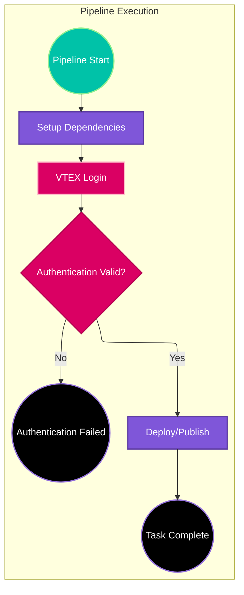
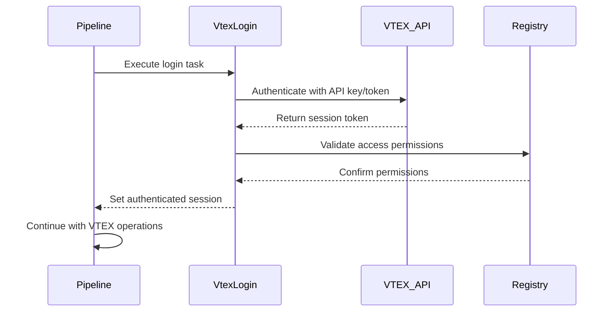

# VTEX Pipeline Tasks

## Overview

The VTEX Pipeline Tasks provide a comprehensive collection of Azure DevOps pipeline tasks specifically designed for VTEX IO development workflows. These tasks automate common VTEX operations including authentication, deployment, publishing, and release management.

## Task Categories

### Authentication Tasks

#### VTEX Login Task (`vtex/login`)

Authenticates with VTEX APIs using API keys and tokens.

**Parameters:**
- `apiKey`: VTEX API Key from admin panel
- `apiToken`: VTEX API Token from admin panel  
- `email`: Email for VTEX authentication
- `account`: VTEX account name

**Usage:**
```yaml
- task: VtexLogin@1
  inputs:
    apiKey: $(VTEX_API_KEY)
    apiToken: $(VTEX_API_TOKEN)
    email: $(VTEX_EMAIL)
    account: $(VTEX_ACCOUNT)
```

### Deployment Tasks

#### VTEX Deploy Task (`vtex/deploy`)

Deploys VTEX applications to workspace environments.

**Features:**
- Force deployment with `--force` flag
- Uses projex wrapper for environment management
- Handles deployment validation and error reporting

**Usage:**
```yaml
- task: VtexDeploy@1
  inputs:
    workspace: $(VTEX_WORKSPACE)
```

#### VTEX Publish Task (`vtex/publish`)

Publishes VTEX applications to the app registry.

**Features:**
- Force publishing with `--yes --force` flags
- Automated version management
- Registry validation

**Usage:**
```yaml
- task: VtexPublish@1
  inputs:
    version: $(APP_VERSION)
```

## Architecture Flow



## Task Implementation Pattern

All VTEX tasks follow this standardized structure:

### Directory Structure
```
taskName/
├── task.json        # Azure DevOps task definition
├── tsconfig.json    # TypeScript compilation config
├── README.md        # Task documentation
├── icon.png         # Task icon (128x128)
└── taskName.ts      # Main implementation
```

### Task Definition Template (`task.json`)

```json
{
  "$schema": "https://raw.githubusercontent.com/Microsoft/azure-pipelines-task-lib/master/tasks.schema.json",
  "id": "unique-task-uuid",
  "name": "TaskName",
  "friendlyName": "Task Display Name",
  "description": "Task description",
  "category": "Utility",
  "author": "MaikRestrepo",
  "version": {
    "Major": 1,
    "Minor": 0,
    "Patch": 0
  },
  "inputs": [
    {
      "name": "inputName",
      "type": "string",
      "label": "Input Label",
      "helpMarkDown": "Input help text",
      "required": true
    }
  ],
  "execution": {
    "Node16": {
      "target": "dist/taskName.js"
    }
  }
}
```

### TypeScript Implementation Template

```typescript
import { getInput, setResult, TaskResult } from 'azure-pipelines-task-lib/task';
import { runCommand } from '../shared/utils';

async function run(): Promise<void> {
    try {
        // Get inputs
        const inputValue = getInput('inputName', true);
        
        // Validate inputs
        if (!inputValue) {
            setResult(TaskResult.Failed, 'Input is required');
            return;
        }
        
        // Execute VTEX command
        const command = `projex vtex run "vtex ${operation} ${inputValue}"`;
        await runCommand(command);
        
        // Success
        setResult(TaskResult.Succeeded, 'Task completed successfully');
    } catch (error) {
        setResult(TaskResult.Failed, `Task failed: ${error.message}`);
    }
}

run();
```

## VTEX Command Patterns

### Projex Wrapper Usage

All VTEX commands use the projex wrapper for environment management:

```typescript
// Standard patterns
const PUBLISH_COMMAND = 'projex vtex run "vtex publish --yes --force"';
const DEPLOY_COMMAND = 'projex vtex run "vtex deploy --force"';
const LOGIN_COMMAND = 'projex vtex run "vtex login"';
```

### Authentication Flow



## Error Handling and Validation

### Input Validation

```typescript
function validateInputs(): boolean {
    const apiKey = getInput('apiKey', true);
    const apiToken = getInput('apiToken', true);
    const account = getInput('account', true);
    
    if (!apiKey || !apiToken || !account) {
        setResult(TaskResult.Failed, 'Required VTEX credentials missing');
        return false;
    }
    
    return true;
}
```

### Command Execution Error Handling

```typescript
try {
    await runCommand(vtexCommand);
    console.log('VTEX command executed successfully');
} catch (error) {
    const errorMessage = error.message || 'Unknown VTEX command error';
    console.error(`VTEX command failed: ${errorMessage}`);
    setResult(TaskResult.Failed, errorMessage);
    throw error;
}
```

## Pipeline Integration

### Standard VTEX Workflow

```yaml
steps:
- task: SetupDependencies@1
  displayName: 'Setup Project Dependencies'

- task: VtexLogin@1
  displayName: 'Login to VTEX'
  inputs:
    apiKey: $(VTEX_API_KEY)
    apiToken: $(VTEX_API_TOKEN)
    email: $(VTEX_EMAIL)
    account: $(VTEX_ACCOUNT)

- task: VtexDeploy@1
  displayName: 'Deploy to VTEX Workspace'
  inputs:
    workspace: $(VTEX_WORKSPACE)

- task: VtexPublish@1
  displayName: 'Publish to VTEX Registry'
  condition: eq(variables['Build.SourceBranch'], 'refs/heads/main')
```

### Environment Variables

| Variable | Description | Required |
|----------|-------------|----------|
| `VTEX_API_KEY` | VTEX API Key from admin panel | Yes |
| `VTEX_API_TOKEN` | VTEX API Token from admin panel | Yes |
| `VTEX_EMAIL` | Email for authentication | Yes |
| `VTEX_ACCOUNT` | VTEX account name | Yes |
| `VTEX_WORKSPACE` | Target workspace for deployment | No |

## Security Considerations

### Credential Management

- Store sensitive data in Azure DevOps variable groups
- Use secret variables for API keys and tokens
- Never log sensitive information in task output
- Validate credentials before executing commands

### Best Practices

```typescript
// ✅ Correct: Use variable groups
const apiKey = getInput('apiKey', true); // From secret variable

// ❌ Incorrect: Hardcode sensitive data
// const apiKey = 'vtexappkey-myaccount-ABCDEF';

// ✅ Correct: Validate before use
if (!apiKey || apiKey.length < 10) {
    setResult(TaskResult.Failed, 'Invalid API key format');
    return;
}
```

## Task Development Guidelines

### Adding New VTEX Tasks

1. **Create task directory** under `tasks/vtex/`
2. **Generate unique UUID** for task.json
3. **Follow naming conventions**: PascalCase for task names
4. **Include comprehensive documentation** in README.md
5. **Add task icon** (128x128 PNG format)
6. **Update webpack configuration** if needed

### Testing VTEX Tasks

```typescript
// Unit test template
describe('VtexTask', () => {
    it('should validate required inputs', () => {
        // Mock missing inputs
        jest.spyOn(taskLib, 'getInput').mockReturnValue('');
        
        expect(() => validateInputs()).toThrow();
    });
    
    it('should execute VTEX command successfully', async () => {
        // Mock successful command execution
        jest.spyOn(utils, 'runCommand').mockResolvedValue('Success');
        
        await run();
        
        expect(taskLib.setResult).toHaveBeenCalledWith(
            TaskResult.Succeeded, 
            'Task completed successfully'
        );
    });
});
```

## Troubleshooting

### Common Issues

1. **Authentication Failures**
   - Verify API key/token validity
   - Check account name spelling
   - Ensure proper permissions in VTEX admin

2. **Command Execution Errors**
   - Verify projex installation on agent
   - Check VTEX CLI version compatibility
   - Validate workspace permissions

3. **Network Connectivity**
   - Ensure agent can reach VTEX APIs
   - Check firewall and proxy settings
   - Verify DNS resolution for VTEX endpoints

### Debug Mode

Enable verbose logging for troubleshooting:

```typescript
const debug = getInput('debug') === 'true';
if (debug) {
    console.log('Debug mode enabled');
    console.log(`Executing command: ${command}`);
}
```

## Future Enhancements

### Planned Features

- Enhanced error reporting with specific VTEX error codes
- Support for multi-workspace deployments
- Integration with VTEX A/B testing frameworks
- Automated rollback capabilities

### Architecture Improvements

- Modular command builders for complex VTEX operations
- Caching mechanisms for frequently used VTEX data
- Enhanced logging and monitoring integration
- Support for VTEX GraphQL API operations
