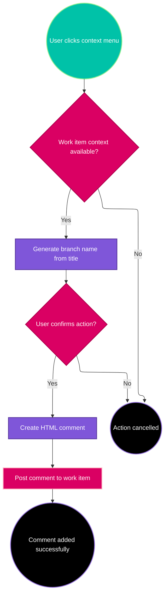
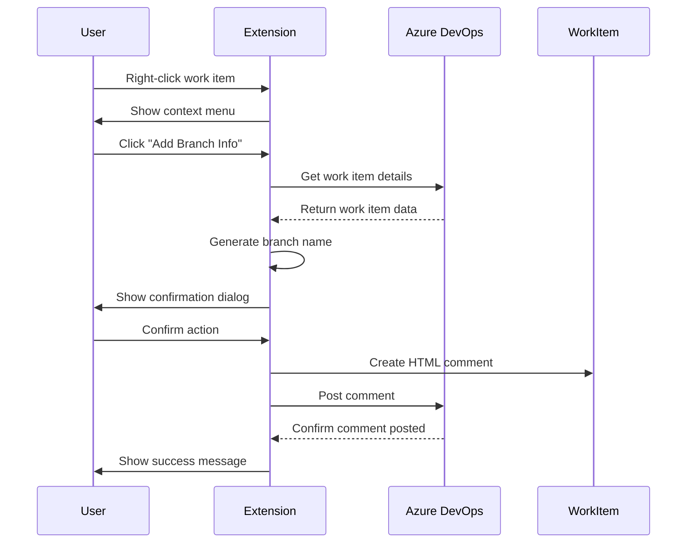

# Work Item Extension

## Overview

The Work Item Extension provides simplified functionality to add branch information comments directly to Azure DevOps work items. This extension adds context menu actions that generate branch names and create formatted comments with branch suggestions.

## Features

### Branch Name Generation
- Automatically generates branch names from work item titles
- Includes sprint/iteration information when available
- Sanitizes titles to create valid git branch names
- Supports configurable branch prefixes

### Comment Creation
- Creates HTML-formatted comments in work items
- Includes branch name suggestions
- Provides copy-to-clipboard functionality
- Uses simple browser dialogs for user interaction

## Architecture



## Implementation Details

### Core Service: WorkItemCommentService

The main service handles all work item interactions:

```typescript
export class WorkItemCommentService {
    private generateBranchName(title: string, iteration?: string): string
    private createBranchComment(branchName: string): string
    public async addBranchInformation(): Promise<void>
}
```

### Key Methods

#### `generateBranchName(title, iteration)`
- Sanitizes work item title for git branch naming
- Removes special characters and spaces
- Converts to kebab-case format
- Optionally includes sprint/iteration prefix

#### `createBranchComment(branchName)`
- Generates HTML-formatted comment
- Includes styled branch name display
- Provides copy-to-clipboard functionality
- Returns complete HTML string for Azure DevOps

#### `addBranchInformation()`
- Main entry point for the extension
- Validates work item context
- Orchestrates branch name generation and comment creation
- Handles user confirmation dialogs

## User Workflow



## Configuration

### Extension Manifest (`vss-extension.json`)

The extension is configured with the following contributions:

```json
{
  "contributions": [
    {
      "id": "work-item-menu",
      "type": "ms.vss-web.action",
      "targets": ["ms.vss-work-web.work-item-context-menu"],
      "properties": {
        "text": "Add Branch Information",
        "uri": "my-hub.html"
      }
    }
  ]
}
```

### Context Requirements

- Must be executed within Azure DevOps work item context
- Requires access to work item tracking services
- Uses browser-based dialogs for user interaction

## Error Handling

### Common Error Scenarios

1. **Work Item Context Missing**
   - Error: Cannot access work item details
   - Solution: Ensure extension runs in work item context

2. **API Connection Failures**
   - Error: Cannot post comment to work item
   - Solution: Verify Azure DevOps authentication

3. **Permission Issues**
   - Error: Insufficient permissions to modify work item
   - Solution: Ensure user has work item edit permissions

### Error Handling Pattern

```typescript
try {
    await this.addBranchInformation();
} catch (error) {
    console.error('Work item extension error:', error);
    alert(`Error: ${error.message}`);
}
```

## Testing

### Manual Testing Checklist

- [ ] Extension loads in Azure DevOps work item view
- [ ] Context menu appears on right-click
- [ ] Branch name generation works with various titles
- [ ] Comment creation includes proper HTML formatting
- [ ] User confirmation dialogs function correctly
- [ ] Comments are successfully posted to work items

### Browser Compatibility

- Supports modern browsers with ES6+ support
- Tested in Chrome, Edge, and Firefox
- Requires Azure DevOps Extension SDK compatibility

## Development Guidelines

### Simple Dialog Pattern

Always use browser-native dialogs instead of Azure DevOps Dialog Service:

```typescript
// ✅ Correct approach
const confirmed = confirm("Add branch information to work item?");
if (confirmed) {
    await this.processBranchInfo();
}

// ❌ Avoid complex dialog services
// const dialogService = await SDK.getService(CommonServiceIds.DialogService);
```

### HTML Comment Structure

Comments should follow this structure:

```html
<div style="font-family: monospace; background: #f5f5f5; padding: 10px; border-radius: 5px;">
    <strong>Suggested Branch Name:</strong><br/>
    <code style="background: #e1e1e1; padding: 2px 4px; border-radius: 3px;">
        {branchName}
    </code>
</div>
```

## Future Enhancements

### Planned Features

- Custom branch naming templates
- Integration with git providers
- Bulk branch name generation
- Branch creation automation

### Architecture Considerations

- Keep extension lightweight and focused
- Maintain compatibility with Azure DevOps updates
- Use progressive enhancement for advanced features
- Ensure graceful degradation for unsupported scenarios
